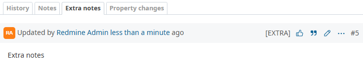

# Redmine Extra Notes

This Redmine plugin lets you manage issue notes as either normal or extra.


## Features

- When adding a note, use the "Extra Notes" checkbox to mark it as extra.
- Extra notes show the `[EXTRA]` label by default.
- The label for extra notes is customizable in the plugin settings.
- Updates the issue history tab behavior:
  - **Notes**: shows normal notes only.
  - **Extra Notes**: shows extra notes only.
  - This tab can be enabled or disabled in the plugin settings.

## Installation

1. Clone the repository into the plugins directory:
```bash
cd {REDMINE_ROOT}/plugins
git clone https://github.com/sk-ys/redmine_extra_notes.git
```

2. Run the database migration:
```bash
bundle exec rake redmine:plugins:migrate RAILS_ENV=production
```

3. Restart Redmine.

## Usage

1. When adding a note, check "Extra Notes" to save it as an Extra note.
2. If enabled, select the "Extra Notes" tab to view extra notes. (If the tab is disabled, extra notes will appear in the regular "Notes" tab as usual.)

## Uninstall

```bash
bundle exec rake redmine:plugins:migrate NAME=redmine_extra_notes VERSION=0 RAILS_ENV=production
```
